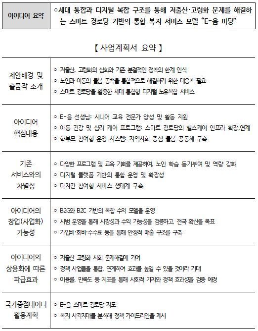

# Tem_fa05-2nd-Hole_In_One 
- 삼정 Future Academy 2차 프로젝트 기획서입니다.
----------------------------

# 프로젝트 기획서

## 1. 프로젝트 정의
- **목표**: 한국사회보장정보원 공모전 참가를 위한 아이디어 구상
- **주요 기능**:
  - 데이터 수집 및 전처리 및 시각화
  - 공모전 참가를 위한 발표 자료 만들기

## 2. 주요 내용
- **프로젝트 기간**: 2025-05-16 ~ 2025-05-26
- **참여 인원**: 송동규, 이재현, 주승완, 최민서
- **데이터 사용처**: 65세 이상 인구수 데이터, 경로당 개수 데이터

## 3. 일정 계획
# 작업 분할 구조 (WBS)

## 4. 핵심 내용
